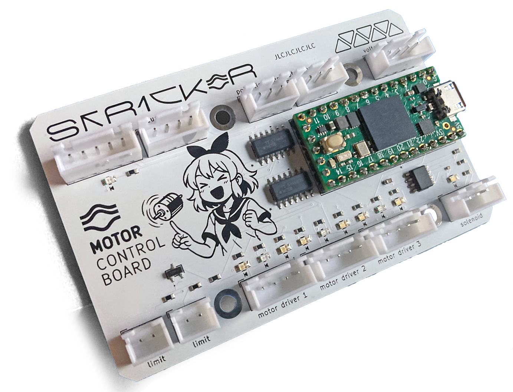

# Teensy Motor Control Board

## Hardware

A Teensy 4.0-based board that controls one 3-DOF robot arm with three motors and an end-effector solenoid.

+ The first DOF has a digital absolute encoder (AS5045 attached to SPI) and a relative encoder (A/B attached to interrupt pins) for precise positioning, in addition to two limit switches that automatically cut off the "enabled" signal for the first motor driver by pulling it `LOW`.

+ The other two DOFs have basic potentiometers (`ADC1`, `ADC2`) and slow linear actuators (these have limit switches built-in).

+ All three motor drivers have pink status LEDs and blue activity LEDs.

+ The solenoid has a blue activity LED.

+ The SPI connection for the absolute encoder has a pink status LED.

+ Voltage and current sensor is attached to I2C (Adafruit INA260).

## Software

### Controller

+ All three actuators are PID controlled, with encoders normalized to the travel range.
+ The controller runs at a frequency between 200 Hz and 1 kHz.
+ Teensy is configured for 12-bit analog conversion.

+ The PID constants for all three actuators are adjustable via ROS parameters.

### ROS Interface

+ Kalman filter matrices for 1st DOF (using absolute and relative encoders) are adjustable via ROS parameters.
+ Target (set-point) positions for all three joints are subscribed to ROS queue.
+ Velocities of all three joints are subscribed to ROS queue (velocity overrides position).
+ Trajectory for the whole arm is subscribed to ROS queue (MoveIt Integration with positions, velocities, and torques).
+ Absolute positions of all three joints are published to ROS queue.
+ Status for SPI, I2C, 3 motor drivers, voltage, and current are published to ROS queue with lesser frequency.

## Pin Mapping

|Pin                   |Net     |Description
|----------------------|--------|-------------------
|3V3                   |`+3V3`  |Power
|GND                   |`GND`   |Ground
|SPI CS   (`D10`)      |`CS`    |Absolute Encoder CS
|SPI SCK  (`D13`)      |`SCK`   |Absolute Encoder CK
|SPI MISO (`D12`)      |`MISO`  |Absolute Encoder DO
|`D9`                  |`SPILED`|Absolute Encoder Status LED
|I2C SCL (`D19`)       |`SCL`   |Voltage/Current Sensor SCL
|I2C SDA (`D18`)       |`SDA`   |Voltage/Current Sensor SDA
|`D2`                  |`A`     |Quadrature Encoder A
|`D5`                  |`B`     |Quadrature Encoder B
|`A0` (`D14`)          |`ADC1`  |Potentiometer 1
|`A1` (`D15`)          |`ADC2`  |Potentiometer 2
|`D16`                 |`PWM1VT`|Motor Driver 1 Stall
|`D0`                  |`PWM1EN`|Motor Driver 1 Enabled
|`D1`                  |`RPWM1` |Motor Driver 1 RPWM
|`D3`                  |`LPWM1` |Motor Driver 1 LPWM
|`D4`                  |`PWM2VT`|Motor Driver 2 Stall
|`D6`                  |`PWM2EN`|Motor Driver 2 Enabled
|`D7`                  |`RPWM2` |Motor Driver 2 RPWM
|`D8`                  |`LPWM2` |Motor Driver 2 LPWM
|`D20`                 |`PWM3VT`|Motor Driver 3 Stall
|`D21`                 |`PWM3EN`|Motor Driver 3 Enabled
|`D22`                 |`RPWM3` |Motor Driver 3 RPWM
|`D23`                 |`LPWM3` |Motor Driver 3 LPWM
|`D17`                 |`SOL`   |Solenoid Driver Signal

# Requirements

## Motor Drivers

There are three external motor drivers, each with `EN` (enabled), `RPWM` (right command), `LPWM` (left command) and `VT` (over-voltage/over-current warning) pins.

Each motor driver has a *status LED* (`SLED`) that lights up whenever the driver is enabled (`EN` is `HIGH`).

Each motor driver also has two *activity LEDs* (`ALED`) that blink whenever `RPWM` or `LPWM` pins are active. Logic *AND* gates are used along with a 555 timer to blink these activity LEDs twice each second whenever a PWM signal is being sent to LPWM or RPWM driver pins.

The 555 timer is configured with two resistors, 10K and 360K, for a blink rate of ~2 Hz.

The first PWM channel differs from the rest in that it has two normally open limit switches that cut off the `EN` signal from microcontroller when closed by using a transistor. In this way, even if this PWM channel is enabled by the controller, closing either switch will disable it.

|Net         |Description
|------------|----------------------------|
|`PWM1EN`    |PWM Channel `1` Enabled
|`RPWM1`     |PWM Channel `1` RPWM
|`LPWM1`     |PWM Channel `1` LPWM
|`PWM1VT`    |PWM Channel `1` Stall Warning
|`PWM2EN`    |PWM Channel `2` Enabled
|`RPWM2`     |PWM Channel `2` RPWM
|`LPWM2`     |PWM Channel `2` LPWM
|`PWM2VT`    |PWM Channel `2` Stall Warning
|`PWM3EN`    |PWM Channel `3` Enabled
|`RPWM3`     |PWM Channel `3` RPWM
|`LPWM3`     |PWM Channel `3` LPWM
|`PWM3VT`    |PWM Channel `3` Stall Warning

## Solenoid

There is one external solenoid with `VDD` (power), `GND` (ground), and `SIG` (signal) pins. The solenoid is enabled when it gets power from Teensy on the `VDD` pin, and gets triggered whenever `SIG` pin is `HIGH`.

The solenoid has its own activity LED called `SOLED` which lights up whenever the solenoid is triggered through the `SIG` pin.

|Net         |Description
|------------|----------------------------|
|`SIG`       |Solenoid Trigger

## Absolute Encoder

An external absolute encoder (AS5045) is attached to Teensy SPI bus with pins `VDD` (power), `CS` (chip select), `SCK` (SPI clock), `MISO` (SPI input), and `GND` (ground).

When the communication with the encoder is initialized successfully, the controller will set digital pin 9 `HIGH`. This pin is connected to a pink encoder status LED through a resistor.

|Net         |Description
|------------|----------------------------|
|`3V3`       |Absolute Encoder Power
|`GND`       |Absolute Encoder Ground
|`SPILED`    |Absolute Encoder Status LED
|`SPILEDR`   |Absolute Encoder Status LED Resistor
|`CS`        |Absolute Encoder SPI Select
|`SCK`       |Absolute Encoder SPI Clock
|`MISO`      |Absolute Encoder SPI Output

## Relative Encoder

An external relative encoder is attached to Teensy interruptable pins `D2` and `D5`. Like the absolute encoder, it is powered through Teensy 3.3V and Ground pins.

|Net         |Description
|------------|----------------------------|
|`3V3`       |Relative Encoder Power
|`GND`       |Relative Encoder Ground
|`A`         |Relative Encoder A Channel
|`B`         |Relative Encoder B Channel

## Potentiometers

Two external potentiometers are attached to Teensy pins `A0` and `A1` through locking connectors. Both need power and ground from Teensy.

|Net         |Description
|------------|----------------------------|
|`3V3`       |Potentiometer Power
|`GND`       |Potentiometer Ground
|`A0`        |Potentiometer 1 Voltage
|`A1`        |Potentiometer 2 Voltage

## Voltage/Current Sensor

An external voltage/current sensor (Adafruit INA260) is attached to Teensy I2C bus with pins `SCL` (I2C Clock) and `SDA` (I2C Data) through a locking connector. This sensor also takes Teensy Power and Ground.

|Net         |Description
|------------|----------------------------|
|`3V3`       |Voltage/Current Sensor Power
|`GND`       |Voltage/Current Sensor Ground
|`SCL`       |Voltage/Current Sensor Clock
|`SDA`       |Voltage/Current Sensor Output

# Bill of Materials

|Description|Part Number|Link
|-|-|-
|Controller|Teensy 4.0|https://www.sparkfun.com/teensy-4-0-headers.html
|Pink LED|XL-2012UPC|https://www.digikey.com/en/products/detail/xinglight/xl-2012upc/25672960
|Blue LED|150080BS75000|https://www.digikey.com/en/products/detail/w%C3%BCrth-elektronik/150080bs75000/4489912
|LED Resistor 1K|RCG06031K00FKEA|https://www.digikey.com/en/products/detail/vishay-dale/rcg06031k00fkea/4172389
|Pullup Resistor 10K|CRCW060310K0FKEA|https://www.digikey.com/en/products/detail/vishay-dale/crcw060310k0fkea/1174782
|Series Resistor 100K|CRCW0603100KFKEA|https://www.digikey.com/en/products/detail/vishay-dale/crcw0603100kfkea/1174896
|IC Gate|SN74HC08DR|https://www.digikey.com/en/products/detail/texas-instruments/sn74hc08dr/276834
|Transistor|SMMBT3904LT1G|https://www.digikey.com/en/products/detail/onsemi/smmbt3904lt1g/3062754
|555 Timer|TLC555CDR|https://www.digikey.com/en/products/detail/texas-instruments/tlc555cdr/276979
|555 Timer Resistor 360K|RC0603FR-07360KL|https://www.digikey.com/en/products/detail/yageo/rc0603fr-07360kl/727183
|555 Timer Capacitor 1uF|CC0603JRX7R7BB105|https://www.digikey.com/en/products/detail/yageo/CC0603JRX7R7BB105/7164369
|555 Timer Capacitor 0.01uF|C0402C103J4RACTU|https://www.digikey.com/en/products/detail/kemet/C0402C103J4RACTU/411041
|JST-XH 5P|JST_XH_B5B-XH-A|https://www.digikey.com/en/products/detail/jst-sales-america-inc/b5b-xh-a/1530483
|JST-XH 4P|JST_XH_B4B-XH-A|https://www.digikey.com/en/products/detail/jst-sales-america-inc/b4b-xh-a/1651047
|JST-XH 3P|JST_XH_B3B-XH-A|https://www.digikey.com/en/products/detail/jst-sales-america-inc/b3b-xh-a/1651046
|JST-XH 2P|JST_XH_B2B-XH-A|https://www.digikey.com/en/products/detail/jst-sales-america-inc/b2b-xh-a/1651045
