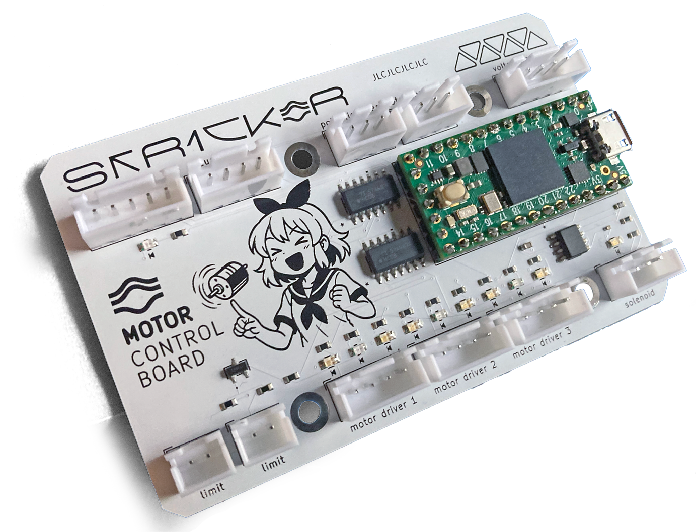

# Arm Motor Control Board

## Hardware

A Teensy 4.0-based board that controls one 3-degree of freedom (DoF) robot arm with three motors and an end-effector solenoid.

+ The first joint has a digital absolute encoder (AS5045 on SPI bus) and a relative encoder (A/B quadrature interrupt pins), in addition to two limit switches that automatically cut off the "enabled" signal for the first motor driver.
+ The other two joints have potentiometers and linear actuators with built-in limit switchesm connected to the remaining two motor drivers.
+ All three motor drivers have red *enabled* LEDs and blue *activity* LEDs.
+ The solenoid has a blue *activity* LED that indicates when the signal is being sent to Adafruit MOSFET Driver.
+ The SPI connection for the absolute encoder has a red *status* LED.
+ Adafruit INA260 Voltage and current sensor is attached to the I2C bus. This is used for system identification and PID controller tuning in the lab (not used in production).

## Software

### Controller

+ All three actuators are PID controlled, with encoders normalized to the travel range.
+ Teensy is configured for 12-bit analog conversion.
+ The PID constants for all three actuators are adjustable via [ROS parameters](../../config/arm.yaml).

### ROS Interface

+ Target (set-point) positions for all three joints are subscribed to a ROS queue.
+ Velocities of all three joints are subscribed to a ROS queue (velocity overrides position).
+ Trajectory for the whole arm is subscribed to ROS queue (MoveIt Integration with positions, velocities, and torques).
+ Absolute positions of all three joints are published to ROS queue.
+ Status for encoder, motor drivers, voltage, and current are published to ROS queue with lesser frequency.

## Pin Mapping

|Pin              |Net        |Description
|-----------------|-----------|-------------------
|3V3              |`+3.3V`    |Power
|GND              |`GND`      |Ground
|SPI CS   (`D10`) |`CS`       |Absolute Encoder CS
|SPI SCK  (`D13`) |`SCK`      |Absolute Encoder CK
|SPI MISO (`D12`) |`MISO`     |Absolute Encoder DO
|`D9`             |`SPIS  `   |Absolute Encoder Status LED
|I2C SCL (`D19`)  |`SCL`      |Voltage/Current Sensor SCL
|I2C SDA (`D18`)  |`SDA`      |Voltage/Current Sensor SDA
|`D2`             |`A`        |Quadrature Encoder A
|`D5`             |`B`        |Quadrature Encoder B
|`A0` (`D14`)     |`A0`       |Potentiometer 1
|`A1` (`D15`)     |`A1`       |Potentiometer 2
|`D16`            |`PWM1VT`   |Motor Driver 1 Current Sense
|`D0`             |`PWM1ENSIG`|Motor Driver 1 Enabled
|`D1`             |`RPWM1`    |Motor Driver 1 RPWM
|`D3`             |`LPWM1`    |Motor Driver 1 LPWM
|`D4`             |`PWM2VT`   |Motor Driver 2 Current Sense
|`D6`             |`PWM2EN`   |Motor Driver 2 Enabled
|`D7`             |`RPWM2`    |Motor Driver 2 RPWM
|`D8`             |`LPWM2`    |Motor Driver 2 LPWM
|`D20`            |`PWM3VT`   |Motor Driver 3 Current Sense
|`D21`            |`PWM3EN`   |Motor Driver 3 Enabled
|`D22`            |`RPWM3`    |Motor Driver 3 RPWM
|`D23`            |`LPWM3`    |Motor Driver 3 LPWM
|`D17`            |`SIG`      |Solenoid Driver Signal

# Requirements

## Motor Drivers

There are three external Mini IBT motor drivers, each with `EN` (enabled), `RPWM` (right PWM velocity), `LPWM` (left PWM velocity) and `VT` (current sense) pins.

Each motor driver has a *status LED* that lights up whenever the driver is enabled (`EN` is `HIGH`).

Each motor driver also has two *activity LEDs* that blink whenever `RPWM` or `LPWM` pins are active. Logic *AND* gates are used along with a 555 timer to blink these activity LEDs twice each second whenever a non-zero PWM signal is being sent to LPWM or RPWM driver pins.

The 555 timer is configured with two resistors, 10K and 360K, for a blink rate of ~2 Hz.

The first PWM channel has two normally open limit switches that cut off the `EN` signal from microcontroller when closed by using a transistor. In this way, even if this PWM channel is enabled by the controller, closing either switch will disable it.

Each motor driver also has a *current sense* pin. These are connected to Teensy ADC pins to read the current of each motor, which is accomplished by placing a `5.1K` resistor to `GND` on current sense lines. The current can be calculated using this formula:

`I = V * 8500 / R` where

+ `I` is the motor current
+ `V` is read voltage from the ADC
+ `R` is the chosen resistor, in this case `5.1K` chosen to produce `3V` on the ADC pin at `5A` (maximum rated) motor current.

|Net         |Description
|------------|----------------------------|
|`PWM1EN`    |PWM Channel `1` Enabled
|`RPWM1`     |PWM Channel `1` RPWM
|`LPWM1`     |PWM Channel `1` LPWM
|`PWM1VT`    |PWM Channel `1` Current Sense
|`PWM2EN`    |PWM Channel `2` Enabled
|`RPWM2`     |PWM Channel `2` RPWM
|`LPWM2`     |PWM Channel `2` LPWM
|`PWM2VT`    |PWM Channel `2` Current Sense
|`PWM3EN`    |PWM Channel `3` Enabled
|`RPWM3`     |PWM Channel `3` RPWM
|`LPWM3`     |PWM Channel `3` LPWM
|`PWM3VT`    |PWM Channel `3` Current Sense

## Solenoid

There is one external solenoid with `VDD` (power), `GND` (ground), and `SIG` (signal) pins. The solenoid is enabled when it gets power from Teensy on the `VDD` pin, and gets triggered whenever `SIG` pin is `HIGH`.

The solenoid has its own activity LED called `SOLED` which lights up whenever the solenoid is triggered through the `SIG` pin.

|Net         |Description
|------------|----------------------------|
|`SIG`       |Solenoid Trigger

## Absolute Encoder

An external absolute encoder (AS5045) is attached to Teensy SPI bus with pins `VDD` (power), `CS` (chip select), `SCK` (SPI clock), `MISO` (SPI input), and `GND` (ground).

When the communication with the encoder is initialized successfully, the controller will set pin `D9` to `HIGH`. This pin is connected to a red encoder status LED.

|Net         |Description
|------------|----------------------------|
|`3V3`       |Absolute Encoder Power
|`GND`       |Absolute Encoder Ground
|`SPIS`      |Absolute Encoder Status LED
|`CS`        |Absolute Encoder SPI Select
|`SCK`       |Absolute Encoder SPI Clock
|`MISO`      |Absolute Encoder SPI Output

## Relative Encoder

An external relative encoder is attached to Teensy interruptable pins `D2` and `D5`. Like the absolute encoder, it is powered through Teensy 3.3V and Ground pins.

|Net         |Description
|------------|----------------------------|
|`3V3`       |Relative Encoder Power
|`GND`       |Relative Encoder Ground
|`A`         |Relative Encoder A Channel
|`B`         |Relative Encoder B Channel

## Potentiometers

Two external potentiometers are attached to Teensy pins `A0` and `A1` through locking connectors:

|Net         |Description
|------------|----------------------------|
|`3V3`       |Potentiometer Power
|`GND`       |Potentiometer Ground
|`A0`        |Potentiometer 1 Voltage
|`A1`        |Potentiometer 2 Voltage

## Voltage/Current Sensor

An external voltage/current sensor (Adafruit INA260) is attached to Teensy I2C bus with pins `SCL` (I2C Clock) and `SDA` (I2C Data) through a locking connector. This sensor also takes Teensy Power and Ground.

|Net         |Description
|------------|----------------------------|
|`3V3`       |Voltage/Current Sensor Power
|`GND`       |Voltage/Current Sensor Ground
|`SCL`       |Voltage/Current Sensor Clock
|`SDA`       |Voltage/Current Sensor Output

# Bill of Materials

|Component|Description|
|-|-|
|[Teensy 4.0](https://www.sparkfun.com/teensy-4-0-headers.html)|MCU
|[NCD0603R1](https://www.lcsc.com/product-detail/C84263.html)|Red LED
|[150080BS75000](https://www.digikey.com/en/products/detail/w%C3%BCrth-elektronik/150080bs75000/4489912)|Blue LED
|[RC0603FR-07150RL](https://www.digikey.com/en/products/detail/yageo/RC0603FR-07150RL/726958)|Blue LED Resistor `150 Ohm`
|[RCG06031K00FKEA](https://www.digikey.com/en/products/detail/vishay-dale/rcg06031k00fkea/4172389)|Red LED Resistor `1K`
|[RC0603FR-075K1L](https://www.digikey.com/en/products/detail/yageo/rc0603fr-075k1l/727268)|Current Sense Resistor `5.1K`
|[CRCW060310K0FKEA](https://www.digikey.com/en/products/detail/vishay-dale/crcw060310k0fkea/1174782)|Pullup Resistor, 555 Timer Resistor `10K`
|[CRCW0603100KFKEA](https://www.digikey.com/en/products/detail/vishay-dale/crcw0603100kfkea/1174896)|Series Resistor `100K`
|[RC0603FR-07360KL](https://www.digikey.com/en/products/detail/yageo/rc0603fr-07360kl/727183)|555 Timer Resistor `360K`
|[SN74HC08DR](https://www.digikey.com/en/products/detail/texas-instruments/sn74hc08dr/276834)|IC Gate
|[SMMBT3904LT1G](https://www.digikey.com/en/products/detail/onsemi/smmbt3904lt1g/3062754)|Transistor
|[TLC555CDR](https://www.digikey.com/en/products/detail/texas-instruments/tlc555cdr/276979)|555 Timer
|[CC0603JRX7R7BB105](https://www.digikey.com/en/products/detail/yageo/CC0603JRX7R7BB105/7164369)|555 Timer Capacitor `1uF`
|[C0402C103J4RACTU](https://www.digikey.com/en/products/detail/kemet/C0402C103J4RACTU/411041)|555 Timer Capacitor `0.01uF` (`100nF`)
|[JST_XH_B5B-XH-A](https://www.digikey.com/en/products/detail/jst-sales-america-inc/b5b-xh-a/1530483)|Absolute Encoder Connector
|[JST_XH_B4B-XH-A](https://www.digikey.com/en/products/detail/jst-sales-america-inc/b4b-xh-a/1651047)|Relative Encoder Connector, Voltage/Current Sensor Connector, PWM connectors
|[JST_XH_B3B-XH-A](https://www.digikey.com/en/products/detail/jst-sales-america-inc/b3b-xh-a/1651046)|Solenoid Connector
|[JST_XH_B2B-XH-A](https://www.digikey.com/en/products/detail/jst-sales-america-inc/b2b-xh-a/1651045)|Limit Switch Connectors

