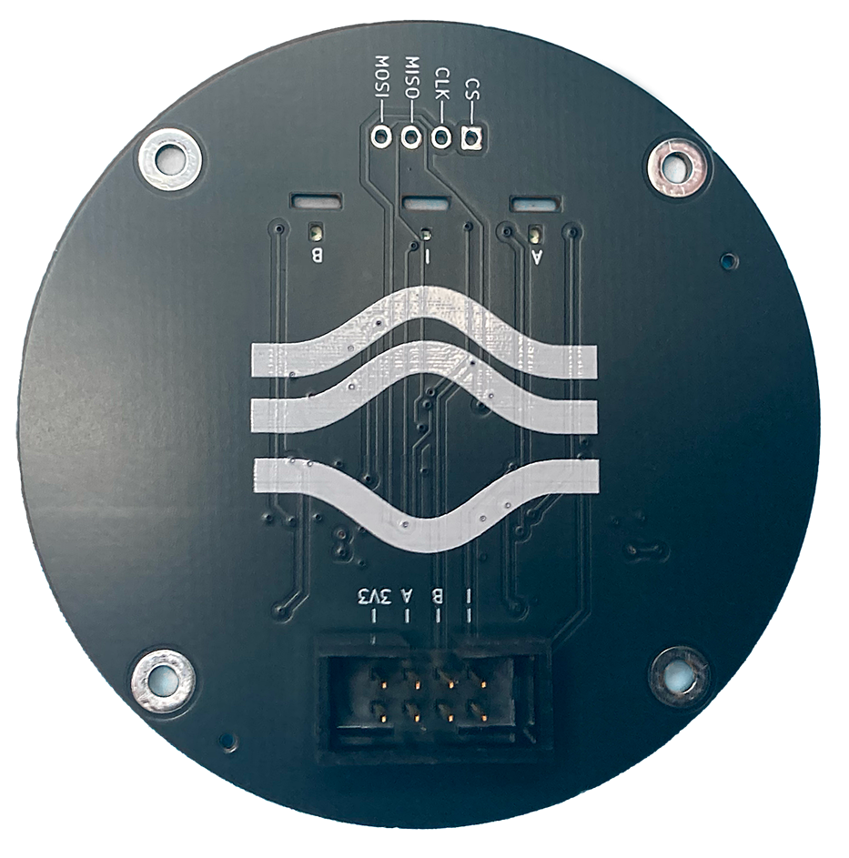
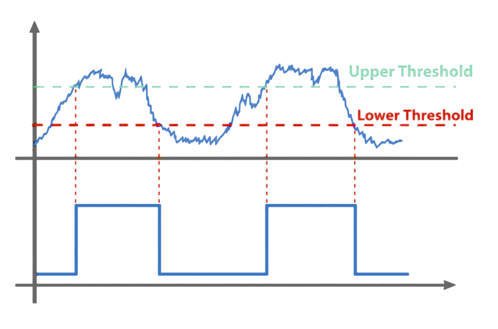
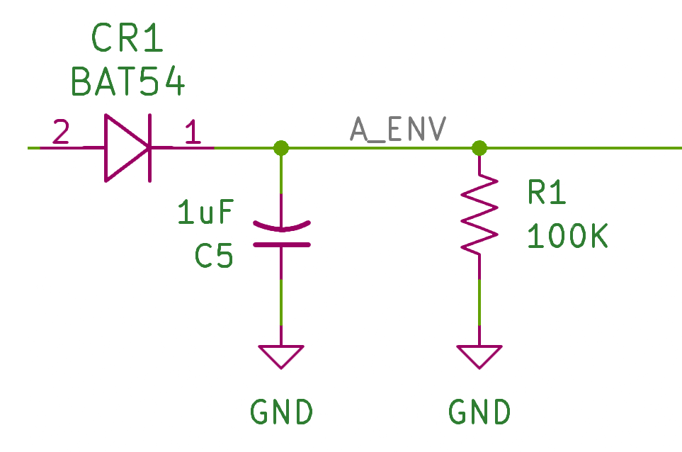

# Leg Encoder Board

A custom board that simplifies mounting `AS5047P` hall-effect on-axis encoder with 14-bit resolution on robot wheel hubs.



> Ready-made alternatives like [SideView Tech](https://www.amazon.com/AS5047P-Magnetic-Position-Breakout-Compatible/dp/B0DLJ6XDNM) and [AS5047P Adapter Board](https://www.digikey.com/en/products/detail/ams-osram-usa-inc/as5047p-adapterboard/5452344) do exist, but have extra pins not used in this project and a board shape that makes them hard to mount.

## Power

For `3.3V` operation `VDD` and `VDD3V3` are bridged and decoupled to `GND` via `100nF` decoupling capacitor and `10uF` bypass capacitor.

Another `1uF` bulk capacitor is on `VDD3V3` line for additional stabilization.

## Signal

The [AS5047P documentation](./doc/AS5047P.pdf) specifies that `A` and `B` pins output a quadrature signal, and an additional `I` pin outputs index (one pulse per complete revolution). In practice, the index is `HIGH` whenever the encoder is approximately near its zero position.

## Indicators

LEDs are attached to quadrature and index (`A`, `B`, `I`) encoder outputs:
+ The `A` and `B` quadrature LEDs blink when the angle changes
+ The `I` index LED lights when the encoder is approximately over its zero position

The following components are used to enable this:

+ `SN74LVC3G17DCTRE4` triple Schmitt buffer
+ `BAT54WS` Schottky diodes
+ `470K` resistors (transistor base bleed)
+ `47K` resistors (transistor base resistor)
+ `100K` resistors (envelope discharge)
+ `1uF` capacitors (envelope storage)
+ `100nF` capacitor (buffer decoupling)
+ `10nF` capacitor (RC storage)
+ `MMBT3904` transistors (LED sink drivers)

Quadrature signals (`A` and `B`) are connected in the following network:

|Signal|Pin|
|-|-|
|`A`, `B`|AS5047 A, B pins going to Schmitt buffer inputs
|`A_BUF`, `B_BUF`|Schmitt buffer output
|`A_EDGE`, `B_EDGE`|Cleaned edges from Schmitt buffer output
|`A_PULSE`, `B_PULSE`|RC circuit that turns edges into pulses
|`A_ENV`, `B_ENV`|Envelope circuit that makes pulses last longer
|`A_BASE`, `B_BASE`|Transistor base
|`A_LED_CATHODE`, `B_LED_CATHODE`|LED cathode
|`A_LED_ANODE`, `B_LED_ANODE`|LED anode

Index signal (`I`) is connected in the following network:

|Signal|Pin|
|-|-|
|`I`|AS5047 I pin to Schmitt buffer input
|`I_BUF`|Schmitt buffer output
|`I_ENV`|Envelope circuit that makes pulses last longer
|`I_BASE`|Transistor base
|`I_LED_CATHODE`|LED cathode
|`I_LED_ANODE`|LED anode

Both Quadrature and Index signals use an integrator circuit to make fast changes visible. Quadrature signals add a differentiator before the integrator to make the lights react only to changes in the quadrature signal, rather than the actual signal.

### Schmitt Buffer

The Schmitt Trigger Buffer clamps quadrature signals to either `HIGH` or `LOW`, which *cleans the edges* of these signals, making them a *sharp* square wave instead of a *noisy*, approximate, square wave with *soft* edges.



This conditioning is needed because the later stages (a differentiator and an integrator) amplify, and therefore are very sensitive to, noise.

### RC Filter (Differentiator)

The differentiator, implemented by using an RC (*Resistor and Capacitor*) circuit, reacts to *changes* in voltage level.

If the input voltage changes from `HIGH` to `LOW`, the output from the differentiator is `HIGH`, same from `LOW` back to `HIGH`. The differentiator stays `LOW` when the voltage is not changing.



This makes the LEDs light only when the quadrature signal changes. It's the only way to make an *activity* LED for this kind of signal because quadrature `A` and `B` channels may be left either `HIGH` or `LOW` depending on when the thing being measured stops moving (there is a truth table called the [grey code](https://cool-emerald.blogspot.com/2014/03/reading-rotary-encoder-using.html) that describes the possible states).


### Envelope Generator (Integrator)

Envelope generators modify the transient characteristics of the incoming signal. The one used here acts like an integrator (it accumulates a value over time) by making the signal rise quickly (fast attack) but decay slowly (slow release).

> Fast attack/slow release combination creates "sustain" which enables the LED indicators to stay on long enough to be seen as a "blink" by the human eye after the differentiator detects a change (movement).


Without this part of the circuit, the LEDs would strobe so fast that to a human they would look dimly lit.

### Transistors

Transistors are used to drive LEDs from the power source, using AS5047's A/B/I pins as on/off switches so they don't drive LEDs directly.

+ Emitter connects to `GND`
+ Collector connects to `LED_CATHODE`
+ Base connects to `ENV` through `47K` base resistor (transitor base is a diode much like an LED, and needs a current-limiting resistor, otherwise Teensy will dump all its available current into the gate, which adds up quickly)
+ Base connects to `GND` through `470K` pull-down resistor (this helps ensure the gate stays closed when connected to nothing, such as during boot)

### Indicators

+ LED anode (`LED_CATHODE`) connects to `3.3V` through LED resistor (depending on LED color)
+ LED cathode (`LED_ANODE`) connects to transistor collector

## Connector

The board uses an IDC connector with 2 rows of 4 pins. This enables twisting each of the four signal wires with ground for better interference rejection.

Conveniently, [CAT5E](https://www.amazon.com/dp/B00KWS6TWS) cables have this precise layout: 8 wires, 4 of them signals, 4 of them grounds, each signal twisted with its ground along the entire length of the cable.

All that remains is cutting off the `RJ45` connectors and crimping on [Molex 0022552082](https://www.digikey.com/en/products/detail/molex/0022552082/313629) / [Molex 0016020086](https://www.digikey.com/en/products/detail/molex/0016020086/467788) to make female locking connectors that fit into IDC male receptacles.

|Column|1|2|3|4|
|-|-|-|-|-|
|Row 1|`3V3`|`GND`|`A`|`GND`|
|Row 2|`B`|`GND`|`I`|`GND`|

## Example

The following can be used to initialize the encoder on [Teensy 4.0](https://www.sparkfun.com/teensy-4-0.html) and read quadrature input:

```c++
#include <Arduino.h>
#include <Encoder.h>

#define PIN_A 2
#define PIN_B 3
#define PIN_I 4

Encoder encoder(PIN_A, PIN_B);
volatile uint32_t revolutions = 0;

void indexInterrupt()
{
  revolutions++;
}

void setup()
{
  Serial.begin(115200);
  while (!Serial && millis() < 2000);

  pinMode(PIN_A, INPUT);
  pinMode(PIN_B, INPUT);
  pinMode(PIN_I, INPUT);

  attachInterrupt(
    digitalPinToInterrupt(PIN_I),
    indexInterrupt,
    RISING
  );

  encoder.write(0);
}

void loop()
{
  int32_t counts = encoder.read();

  Serial.print("counts ");
  Serial.print(counts);
  Serial.print("revolutions ");
  Serial.println(revolutions);

  delay(10);
}
```

## Bill of Materials

|Component|Description|
|-|-|
|[AS5047P-ATST](https://www.digikey.com/en/products/detail/ams-osram-usa-inc/as5047p-atst-tssop14-lf-t-rdp/5288535)|Encoder|
|[CC0603KRX7R9BB104](https://www.digikey.com/en/products/detail/yageo/cc0603krx7r9bb104/2103082)|`100nF` Decoupling Capacitor|
|[GRM1885C1H103JA01D](https://www.digikey.com/en/models/4421555)|`10nF` Bypass Capacitor|
|[CC0603JRX7R7BB105](https://www.digikey.com/en/products/detail/yageo/CC0603JRX7R7BB105/7164369)|`1uF` Bulk Capacitor, Envelope Capacitor|
|[150080BS75000](https://www.digikey.com/en/products/detail/w%C3%BCrth-elektronik/)|Blue LED for A and B channels|
|[NCD0603R1](https://www.lcsc.com/product-detail/C84263.html?s_z=s_C84263)|Red LED for I channel|
|[RC0603FR-07470KL](https://www.digikey.com/en/products/detail/yageo/rc0603fr-07470kl/727257)|`470K` Bleed Resistor|
|[RCG06031K00FKEA](https://www.digikey.com/en/products/detail/vishay-dale/rcg06031k00fkea/4172389)|`1K` Resistor (Red LED)|
|[RC0603FR-0747KL](https://www.digikey.com/en/products/detail/yageo/RC0603FR-0747KL/730200)|`47K` Transistor Base Resistor|
|[CRCW0603100KFKEA](https://www.digikey.com/en/products/detail/vishay-dale/crcw0603100kfkea/1174896)|`100K` Discharge Resistor|
|[RC0603FR-07150RL](https://www.digikey.com/en/products/detail/yageo/rc0603fr-07150rl/726958)|`150 Ohm` Resistor (Blue LED)|
|[RC0603FR-0722RL](https://www.digikey.com/en/products/detail/yageo/rc0603fr-0722rl/727055)|`22 Ohm` Series Resistor (A/B/I outputs to connector)|
|[SN74LVC3G17DCTRE4](https://www.digikey.com/en/products/detail/texas-instruments/sn74lvc3g17dctre4/1592395)|Schmitt-trigger buffer|
|[BAT54WS-7-F](https://www.digikey.com/en/products/detail/diodes-incorporated/BAT54WS-7-F/804865)|Envelope Diode|
|[MMBT3904LT1G](https://www.digikey.com/en/products/detail/onsemi/MMBT3904LT1G/919601)|LED Transistor|