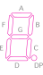

# Leg Robot Board

A board that controls the mobile platform with four mecanum wheels:

+ Leg Actuators
+ Leg Actuator Potentiometers
+ Leg Wheels
+ Leg Wheel Encoders
+ 9-DOF IMU
+ Enabled and PWM activity LEDs
+ Wheel Speed 7-Segment LED Indicators

## Modules

The following components are placed onto the board as modules:

|Module|Function|
|-|-|
|[Teensy 4.1](https://www.pjrc.com/store/teensy41.html)|[ROS](https://www.ros.org/) Node|
|[Adafruit 9-DOF IMU](https://www.adafruit.com/product/2472)|[TF2](https://wiki.ros.org/tf2) Transform|

## Devices

The following external components are connected to the board via `JST-XH` locking connectors:

|Device|Function|
|-|-|
|8x [IBT2 Motor Drivers](https://www.amazon.com/2-Piece-High-Power-Limiting-Function-Suitable/dp/B0DXKXKYRK)|Wheel Motor Drivers, Leg Actuator Drivers (`8` pin IDC connector: `3V3`, `GND`, `L_EN`, `R_EN`, `LPWM`, `RPWM`, `L_IS`, `R_IS`)|
|4x [Feedback Rod Linear Actuator](https://www.firgelliauto.com/products/feedback-rod-actuator?variant=2632742851) Potentiometers|Leg Actuator Potentiometers (`3` pin JST-XH connector: `3V3`, `SIG`, `GND`)|
|4x [Leg (Wheel) Encoder Board](../LegEncoderBoard/readme.md)|Wheel Encoders (`8` pin IDC connector: `A`, `B`, `I`, `3V3`, and four `GND`'s|

## Functionality

### PWM

There are four legs and each has two motors: a linear lift actuator and a brushed DC motor that runs the wheel.

Each PWM channel gets its own `EN` (Enabled) signal. The current sense signals (`L_IS`, `R_IS`) are included in the connector layout and sent over the wire, but not used anywhere on the board because there aren't enough pins for them. A multiplexer can be added later if the signals are desired.

### ADC

The linear lift actuators have built-in multi-turn potentiometers. These are routed to Teensy `ADC` pins.

### Quadrature

The [wheel encoders](../LegEncoderBoard/readme.md) are connected to each of the four wheels, outputting `A`, `B`, and `I` pulses counting rotations (`1000` pulses per revolution).

### Number Displays

Four 7-segment common anode LED number displays with decimal points display the speed of each wheel from `0.0` to `1.0`. They are driven by an LED multiplexer.

The LED multiplexer is mapped to four 2-digit LED displays with decimal point as follows:

| Display function                 | `IS31FL3730` pins |
| -------------------------------- | ----------------- |
| Digit common anodes              | `SW1–SW8`         |
| Segments A, B, C, D, E, F, G, DP | `CS1–CS8`         |

The [3621BH](https://www.amazon.com/uxcell-Common-Segment-Display-Digital/dp/B07GTRS9L2) common-anode LED displays have the following pin footprint:

| |1|2|3|4|5|
|-|-|-|-|-|-|
|1|`COM0`|`B`|`C`|`E`|`D`|
|2|`G`|`DP`|`A`|`F`|`COM1`|

The digit segments are mapped as follows:

|Digit|Segments
|-|-|
||`A` - Top of upper square `F` - Left of upper square `B` - Right of upper square `G` - Link of both squares `E` - Left of lower square `C` - Right of lower square `D` - Bottom of lower square `DP` - Decimal point

## Pin Mapping

This board is essentially a shield. Labeled locking connectors are provided for all of the devices, PWM enabled/activity is indicated by LEDs, and wheel speeds are indicated by number displays.

| Pin            | Function                       | Group                     |
| -------------- | ------------------------------ | ------------------------- |
| `A16`          | Actuator 1 Potentiometer `SIG` | Front Left Leg (Actuator) |
| `D32`          | Quadrature Encoder 1 `A`       | Front Left Leg (Wheel)    |
| `D33`          | Quadrature Encoder 1 `B`       | Front Left Leg (Wheel)    |
| `D22`          | Quadrature Encoder 1 `Index`   | Front Left Leg (Wheel)    |
| `D26`          | Motor Driver 1 `EN`            | Front Left Leg (Wheel)    |
| `D27`          | Motor Driver 2 `EN`            | Front Left Leg (Actuator) |
| `D0`           | Motor Driver 1 `RPWM`          | Front Left Leg (Wheel)    |
| `D1`           | Motor Driver 1 `LPWM`          | Front Left Leg (Wheel)    |
| `D2`           | Motor Driver 2 `RPWM`          | Front Left Leg (Actuator) |
| `D3`           | Motor Driver 2 `LPWM`          | Front Left Leg (Actuator) |
| `A17`          | Actuator 2 Potentiometer `SIG` | Front Right Leg (Actuator)|
| `D34`          | Quadrature Encoder 2 `A`       | Front Right Leg (Wheel)   |
| `D35`          | Quadrature Encoder 2 `B`       | Front Right Leg (Wheel)   |
| `D23`          | Quadrature Encoder 2 `Index`   | Front Right Leg (Wheel)   |
| `D28`          | Motor Driver 3 `EN`            | Front Right Leg (Wheel)   |
| `D29`          | Motor Driver 4 `EN`            | Front Right Leg (Actuator)|
| `D4`           | Motor Driver 3 `RPWM`          | Front Right Leg (Wheel)   |
| `D5`           | Motor Driver 3 `LPWM`          | Front Right Leg (Wheel)   |
| `D6`           | Motor Driver 4 `RPWM`          | Front Right Leg (Actuator)|
| `D7`           | Motor Driver 4 `LPWM`          | Front Right Leg (Actuator)|
| `A2`           | Actuator 3 Potentiometer `SIG` | Rear Left Leg (Actuator)  |
| `D36`          | Quadrature Encoder 3 `A`       | Rear Left Leg (Wheel)     |
| `D37`          | Quadrature Encoder 3 `B`       | Rear Left Leg (Wheel)     |
| `D24`          | Quadrature Encoder 3 `Index`   | Rear Left Leg (Wheel)     |
| `D30`          | Motor Driver 5 `EN`            | Rear Left Leg (Wheel)     |
| `D31`          | Motor Driver 6 `EN`            | Rear Left Leg (Actuator)  |
| `D8`           | Motor Driver 5 `RPWM`          | Rear Left Leg (Wheel)     |
| `D9`           | Motor Driver 5 `LPWM`          | Rear Left Leg (Wheel)     |
| `D10`          | Motor Driver 6 `RPWM`          | Rear Left Leg (Actuator)  |
| `D11`          | Motor Driver 6 `LPWM`          | Rear Left Leg (Actuator)  |
| `A3`           | Actuator 4 Potentiometer `SIG` | Rear Right Leg (Actuator) |
| `D38`          | Quadrature Encoder 4 `A`       | Rear Right Leg (Wheel)    |
| `D39`          | Quadrature Encoder 4 `B`       | Rear Right Leg (Wheel)    |
| `D25`          | Quadrature Encoder 4 `Index`   | Rear Right Leg (Wheel)    |
| `D20`          | Motor Driver 7 `EN`            | Rear Right Leg (Wheel)    |
| `D21`          | Motor Driver 8 `EN`            | Rear Right Leg (Actuator) |
| `D12`          | Motor Driver 7 `RPWM`          | Rear Right Leg (Wheel)    |
| `D13`          | Motor Driver 7 `LPWM`          | Rear Right Leg (Wheel)    |
| `D14`          | Motor Driver 8 `RPWM`          | Rear Right Leg (Actuator) |
| `D15`          | Motor Driver 8 `LPWM`          | Rear Right Leg (Actuator) |
| `A5`           | I2C `SCL`                      | IMU, LED Driver           |
| `A4`           | I2C `SDA`                      | IMU, LED Driver           |

## Buses

|Device|Bus|Address
|-|-|-|
|IMU|I2C|`0x28` (`ADR` tied to `GND` to set address)|
|IS31FL3730|I2C|`0x74`|

## Bill of Materials

|Component|Description|
|-|-|
|[IS31FL3730](https://www.digikey.com/en/products/detail/lumissil-microsystems/IS31FL3730-QFLS2-TR/5319756)|LED Driver/Multiplexer
|[CL3621BH](https://www.amazon.com/dp/B07GTQTD8S)|LED Displays (2-Digit, 7-Segment, 10-Pin Common Anode) for Wheel Speeds
|[XL-1608SURC-06](https://www.lcsc.com/product-detail/C965799.html)|Red LED for `EN` signals|
|[150080BS75000](https://www.digikey.com/en/products/detail/w%C3%BCrth-elektronik/)|Blue LED for `LPWM`/`RPWM` signals|
|[RC0603FR-07150RL](https://www.digikey.com/en/products/detail/yageo/RC0603FR-07150RL/726958)|`150 Ohm` LED Resistor|
|[RC0603FR-07470RL](https://www.digikey.com/en/products/detail/yageo/RC0603FR-07470RL/727256)|`470R` Red LED Resistor|
|[RCG06031K00FKEA](https://www.digikey.com/en/products/detail/vishay-dale/rcg06031k00fkea/4172389)|`1K` LED Resistor|
|[RC0603FR-072K2L](https://www.digikey.com/en/products/detail/yageo/rc0603fr-072k2l/727016)|`2.2K` Series Resistor (ADC channels)|
|[CR0603-FX-4701ELF](https://www.digikey.com/en/products/detail/bourns-inc/cr0603-fx-4701elf/3740916)|`4.7K` Pull-Up Resistor for LED Multiplexer|
|[CRCW060310K0FKEA](https://www.digikey.com/en/products/detail/vishay-dale/crcw060310k0fkea/1174782)|`10K` 555 Timer Pull-Up Resistor, Transistor Base Resistor|
|[HoAR0603-1/10W-20KR-1%-TCR25](https://jlcpcb.com/partdetail/C5123585)|`20K` LED Driver Current Setting Resistor|
|[CRCW0603100KFKEA](https://www.digikey.com/en/products/detail/vishay-dale/crcw0603100kfkea/1174896)|`100K` Transistor Base Pull-Down Resistor|
|[RC0603FR-07360KL](https://www.digikey.com/en/products/detail/yageo/rc0603fr-07360kl/727183)|`360K` 555 Timer Resistor|
|[C0402C103J4RACTU](https://www.digikey.com/en/products/detail/kemet/C0402C103J4RACTU/411041)|`10nF` 555 Timer Capacitor|
|[CL10B473KB8NNNC](https://www.digikey.com/en/products/detail/samsung-electro-mechanics/cl10b473kb8nnnc/3886721)|`47nF` Decoupling Capacitor (ADC channels)|
|[CC0603KRX7R9BB104](https://www.digikey.com/en/products/detail/yageo/cc0603krx7r9bb104/2103082)|`100nF` IMU Capacitor|
|[CC0603JRX7R7BB105](https://www.digikey.com/en/products/detail/yageo/CC0603JRX7R7BB105/7164369)|`1uF` 555 Timer Capacitor|
|[SN74HC08DR](https://www.digikey.com/en/products/detail/texas-instruments/sn74hc08dr/276834)|IC Gate|
|[MMBT3904LT1G](https://www.digikey.com/en/products/detail/onsemi/MMBT3904LT1G/919601)|LED Transistor|
|[TLC555CDR](https://www.digikey.com/en/products/detail/texas-instruments/tlc555cdr/276979)|555 Timer|
|[JST_XH_B3B-XH-A](https://www.digikey.com/en/products/detail/jst-sales-america-inc/b3b-xh-a/1651046)|Actuator Potentiometers (`3V3`, `SIG`, `GND`)|
|[Molex 0702460802](https://www.digikey.com/en/products/detail/molex/0702460802/760180)|Motor Drivers (`LPWM`, `RPWM`, `L_EN`, `R_EN`, `L_IS`, `R_IS`, `3V3`, `GND`)|
|[Teensy 4.1](https://www.sparkfun.com/teensy-4-1.html)|Teensy 4.1 without Headers|
|[ICM-648-1-GT-HT](https://www.digikey.com/en/products/detail/adam-tech/ICM-648-1-GT-HT/9832918)|Teensy IC DIP Socket, 48P|
|[Needle Headers](https://www.amazon.com/dp/B09WH8N3HX)|Teensy Needle Headers for DIP Socket|
|[DIP Socket 10 pin](https://www.amazon.com/dp/B0FVDT8JGV)|LED number displays IC socket
