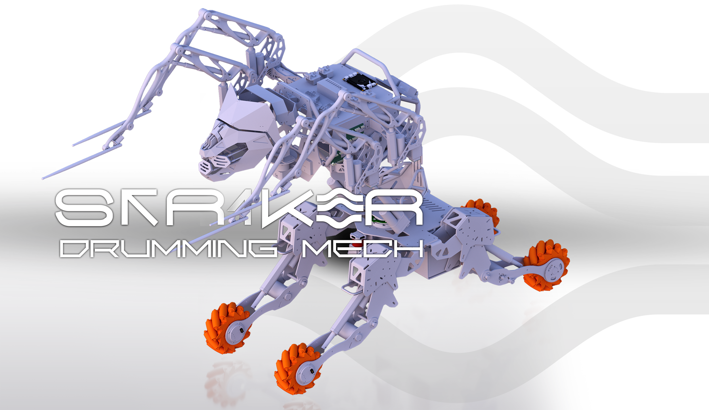
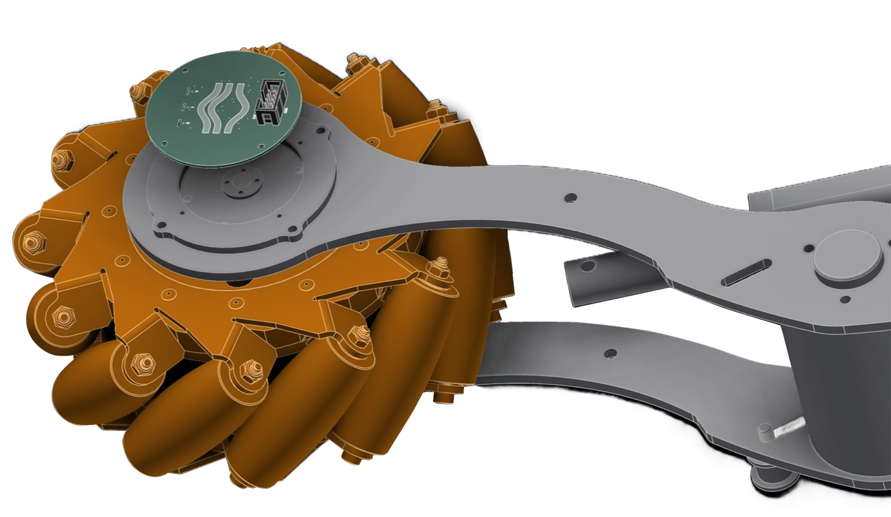
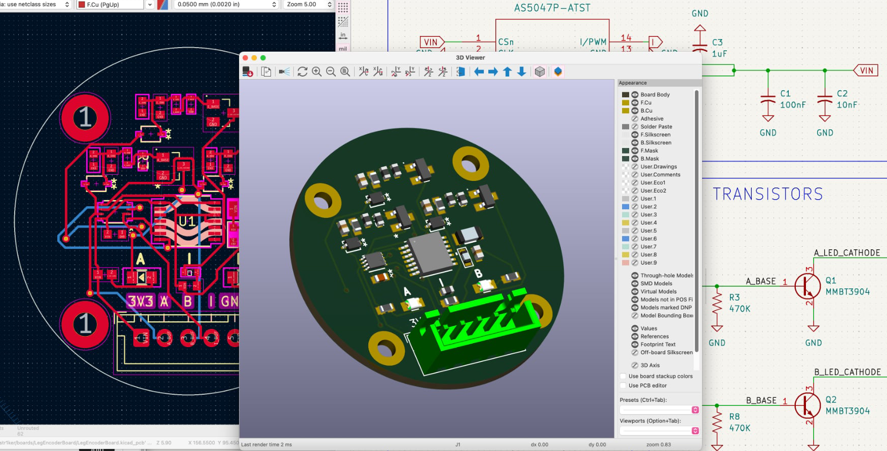
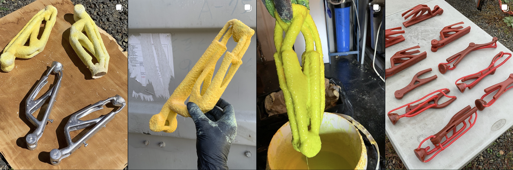
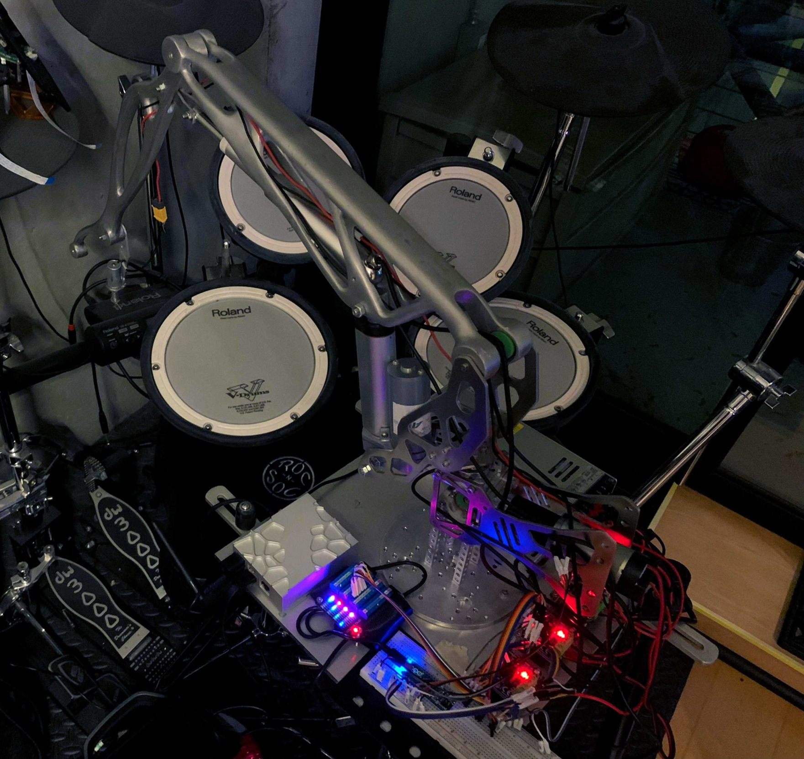
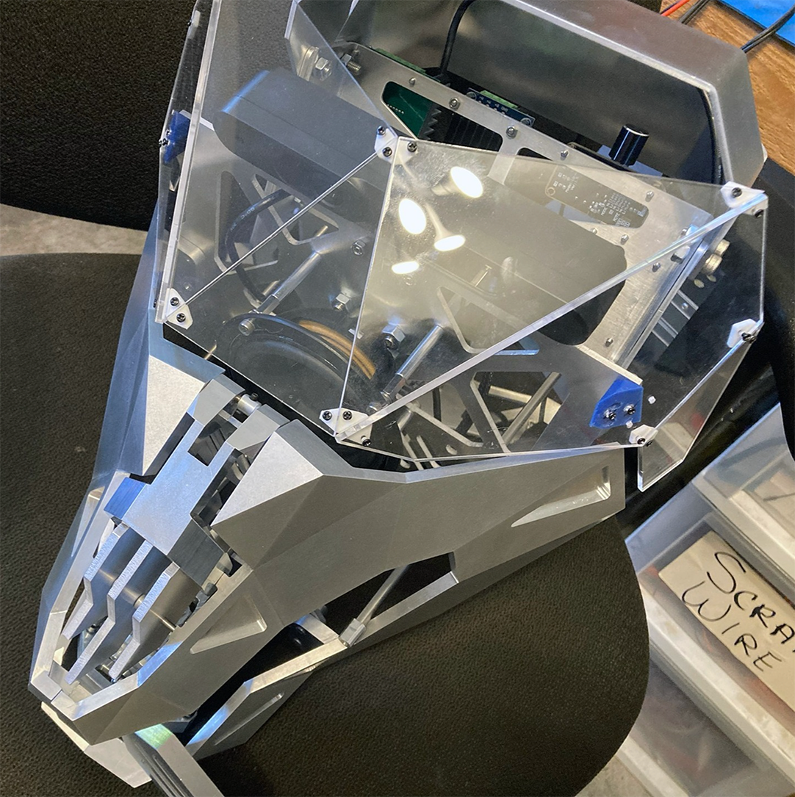
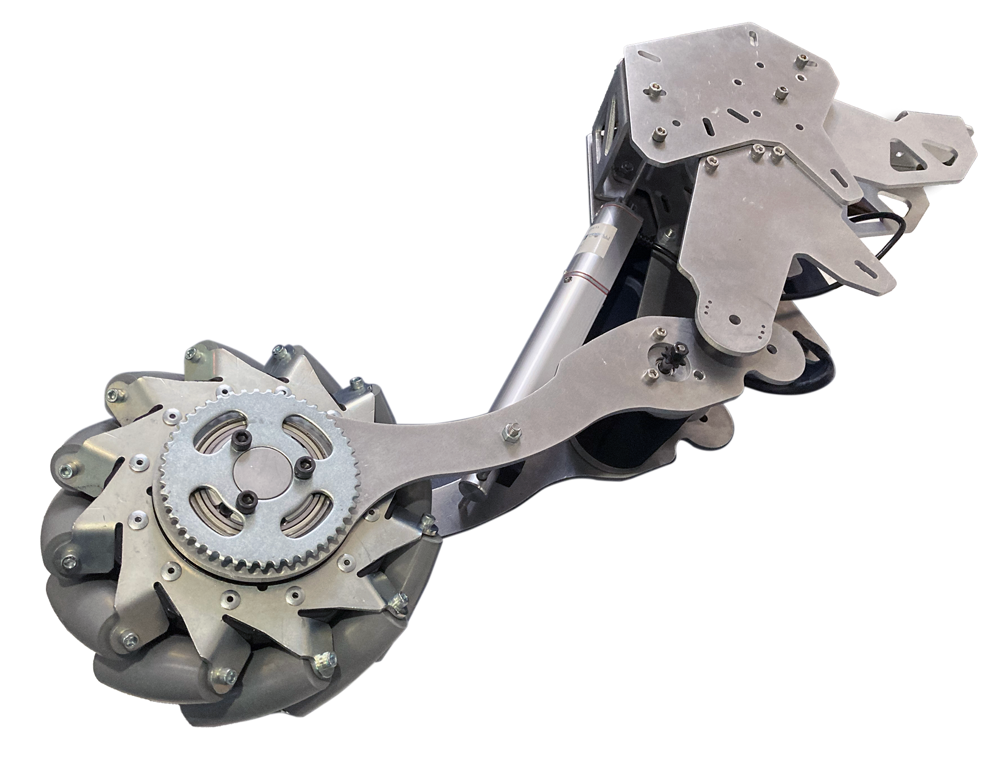
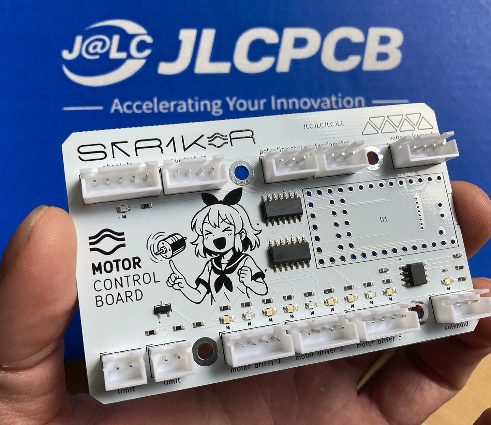

# Str1ker: The Drumming Mech

This repository contains source code, mechanical parts, and printed circuit boards for [Str1ker](https://www.01binary.us/projects/drumming-robot/) drumming robot.



## Overview

Striker is a human-scale teleoperated mech built with metal casting, CNC machining, 3D printing, sheet metal parts, tube frame chassis, and pre-made components.

> This open-source educational project features custom electronics and [Robot Operating System](https://www.ros.org/) integration, demonstrating how to design and build a large robot that combines mobility, sensing, and manipulation.

The robot moves on a mecanum base, articulates its head and arms, and visualizes live lidar and RGB-D perception in Robot Visualization tool ([RViz](https://wiki.ros.org/rviz/Tutorials)).

The arms terminate in percussive end-effectors, designed for future live drum performance.

More details on [my blog](https://www.01binary.us/projects/drumming-robot/) and media on [instagram](https://www.instagram.com/01binaryus/). Say hello at the next [Portland Area Robotics Society](https://portlandrobotics.org/home.php?link_id=1) monthly meetup!

## Details

### Mechanical Design

[Autodesk Inventor mechanical parts](./cad) available in `./cad`.



### Electrical Design

[KiCad schematics and boards](./boards/) available in `./boards`.



### Fabrication

The arms were cast out of Aluminum 356 in the metal foundry at [Ctrl^H Hackerspace](https://pdxhackerspace.org/index.html) and welded together by [skorndaap](https://www.instagram.com/skorndaap/), then polished.





Tube frame chassis welding by [skorndaap](https://www.instagram.com/skorndaap/).

The CNC, sheet metal, tube frame, and 3D-printed parts were ordered from [Xometry](https://www.xometry.com/) online service.





The PCB's were ordered from [JLCPCB](https://jlcpcb.com/) using JLCPCB KiCad plugin.



Pre-made components sourced from [GoBilda](https://www.gobilda.com/), [Pololu](https://www.pololu.com/), [McMaster-Carr](https://www.mcmaster.com/), [Robot Shop](https://www.robotshop.com/), and Amazon.

### Software

- [Ubuntu 20.04](https://wiki.ros.org/noetic/Installation/Ubunt)
- [ROS Noetic](https://wiki.ros.org/noetic)
- [MoveIt](https://moveit.ai/)
- [ROS Control](./src/hardware/hardware.h)
- [Inverse Kinematics solver](./src/plugins/)
- [PID controller](./src/drivers/arm/pid.h)
- [ROS](./src) and [ROS Serial](./src/drivers/) nodes

### Hardware

- [Teensy 4.0](https://www.sparkfun.com/teensy-4-0.html) MCUs for arms, body and legs
- [Weidian](https://www.amazon.com/dp/B0BTVN6V7W) industrial mini PC for high-level control
- [Intel NUC 11](https://www.amazon.com/dp/B09PRL9V2F) for teleoperation & simulation

## System Requirements

The high-level controllers (Ubuntu 20.04/ROS Noetic) can run on any [mini PC](https://www.amazon.com/s?k=mini+pc), [NUC](https://www.amazon.com/s?k=NUC), a low-end SBC like [Raspberry Pi](https://www.amazon.com/Raspberry-Model-2019-Quad-Bluetooth/dp/B07TD43PDZ/) or a high-end SBC like [Latte Panda 3 Delta](https://www.amazon.com/LattePanda-864-Pocket-Sized-Windows-Single-Computer/dp/B0C6TCP3MN).

The low-level serial nodes that run motors and sensors were designed for Arduino Mega, and are currently being ported to [Teensy 4.0](https://www.sparkfun.com/teensy-4-0.html) because its more powerful specs make it a better choice for robotics.

Teleoperation and simulation requires 3D visualization software like [RViz](https://wiki.ros.org/rviz) and [Gazebo](https://gazebosim.org/home), which [like NVidia cards](https://wiki.ros.org/simulator_gazebo/SystemRequirements).

## Setup

Follow the [official guide](https://wiki.ros.org/noetic/Installation/Ubuntu) to install ROS Noetic and [configure the ROS environment](https://wiki.ros.org/ROS/Tutorials/InstallingandConfiguringROSEnvironment).

Configure source control:

```
git config --global user.name <your username>
git config --global user.email <your email>
git config --global credential.helper store
```

Clone the projects (when asked for password, paste your [Personal Access Token](https://docs.github.com/en/authentication/keeping-your-account-and-data-secure/creating-a-personal-access-token)):

```
mkdir -p ~/catkin_ws/src
cd ~/catkin_ws/src

git clone https://github.com/01binary/str1ker.git
git clone https://github.com/01binary/str1ker_moveit_config.git

cd ./str1ker
git sparse-checkout init --cone
git sparse-checkout set .vscode src config launch description msg
```

## Install Packages from Source

Follow the [official guide](https://moveit.ai/install/source/) to build MoveIt from source using `catkin_ws` as the workspace name instead of `moveit_ws`.

Build Gazebo plugins from source:

```
cd ~/catkin_ws/src
git clone https://github.com/roboticsgroup/roboticsgroup_gazebo_plugins
```

## Install Packages

```
cd ~/catkin_ws/src
rosdep install -y --from-paths . --ignore-src --rosdistro noetic
```

## Build

To invoke the build command while in `~/catkin_ws` use `catkin_make` with no parameters. Otherwise use `-C` to specify the workspace directory:

```
catkin_make -C ~/catkin_ws
```

To build only this package and its dependencies:

```
catkin_make --only-pkg-with-deps str1ker
```

To build only this package:

```
catkin_make --pkg str1ker
```

To clear the build filter:

```
catkin_make -DCATKIN_WHITELIST_PACKAGES=""
```

To switch between Debug and Release

```
catkin_make -DCMAKE_BUILD_TYPE=Debug | Release
```

## Environment

One-time setup after the first build.

```
catkin_make install
source /opt/ros/noetic/setup.bash

echo "source /opt/ros/noetic/setup.bash" >> ~/.bashrc
source ~/.bashrc
```

## Upload

The low-level hardware is handled by an Arduino ROS node in `src/drivers/arm.ino`.

To build it, first generate ROS message headers for Arduino:

```
sudo apt-get install ros-${ROS_DISTRO}-rosserial-arduino
sudo apt-get install ros-${ROS_DISTRO}-rosserial

rosrun rosserial_arduino make_libraries.py ~/Arduino/libraries
```

> If you installed Arduino IDE as a *snap* plugin, you could also try looking in `~/snap/arduino`.

Compile and upload the ROS node. The default launch configuration in `robot.launch` will connect to `/dev/ttyACM0` automatically.

## Launch

### Hardware

To launch the low-level hardware node:

```
roslaunch str1ker hardware.launch
```

### Full Stack

To launch both high-level and low-level nodes:

```
roslaunch str1ker robot.launch
```

### Teleoperation

To teleoperate the robot:

```
roslaunch str1ker_moveit_config demo.launch
```

### Simulation

To simulate the robot:

```
roslaunch str1ker_moveit_config gazebo.launch
```

### Configuration

The low-level configuration is in YAML format at [config](./config/).

To launch the MoveIt wizard for custom robot arm setup:

```
roslaunch moveit_setup_assistant setup_assistant.launch
```

## Logging

Logging level can be specified in `$ROS_ROOT/config/rosconsole.config`, either globally or for a specific package.
