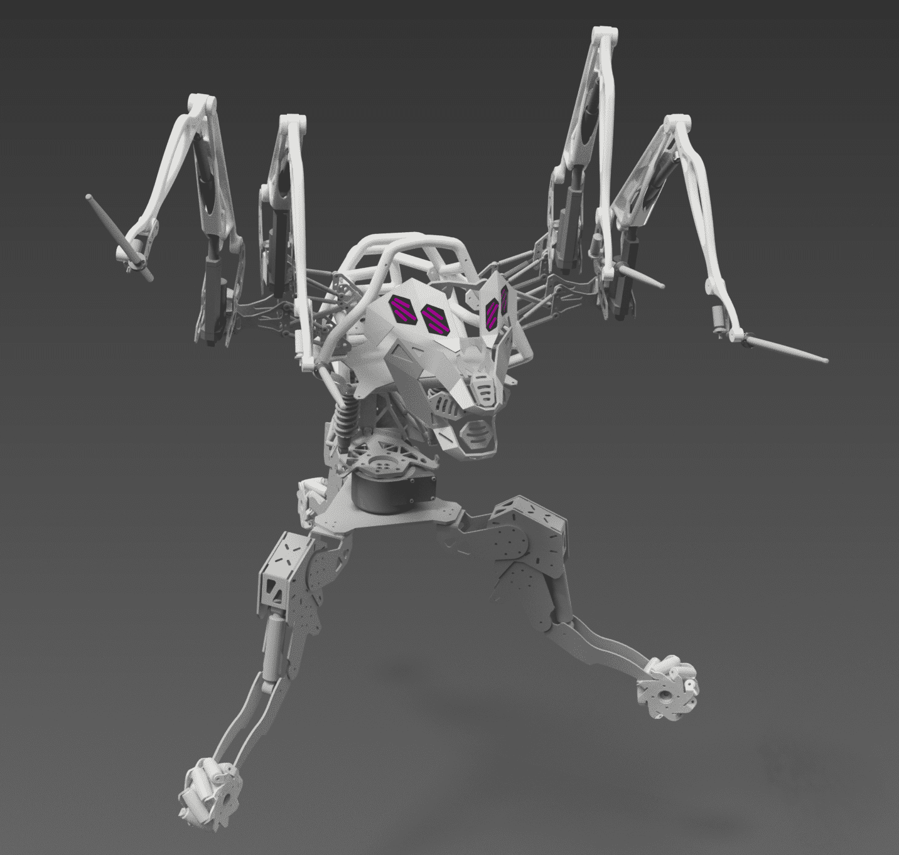
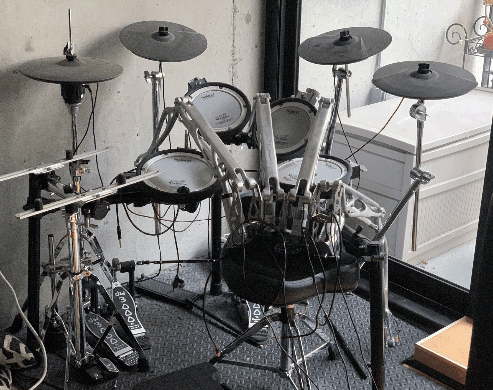
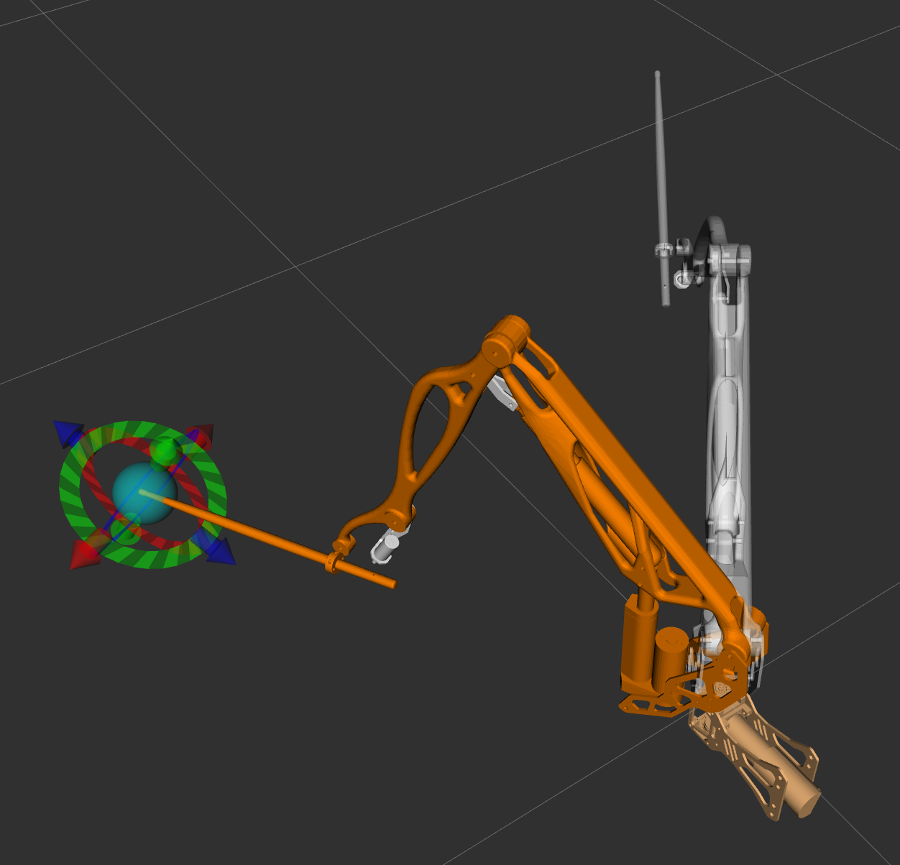

# Drumming Robot

Source code and parts for [Str1ker](https://www.01binary.us/projects/drumming-robot/) drumming robot. See [build log](https://hackaday.io/project/171607-drumming-robot) on Hackaday.io.






## System Requirements

### Hardware

**Minimum**: [Raspberry Pi 4B 8GB](https://www.amazon.com/Raspberry-Pi-Computer-Suitable-Workstation/dp/B0899VXM8F) + [Arduino Micro](https://www.amazon.com/Arduino-Micro-Headers-A000053-Controller/dp/B00AFY2S56)

**Recommended**: [Latte Panda 3 Delta](https://www.amazon.com/LattePanda-Delta-864-Pocket-Sized-Computer/dp/B0BB7CY51B)

### Software

The Robot Operating System (ROS) only runs on Linux. ROS Noetic packages are only available for Ubuntu Focal `20.04.x`.

Running on Raspbian requires [building ROS from source](https://varhowto.com/install-ros-noetic-raspberry-pi-4/).

See [Installing from source](http://wiki.ros.org/noetic/Installation/Source) for more information.

## Source Control

First-time git setup on Ubuntu:

```
git config --global user.name <your username>
git config --global user.email <your email>
git config --global credential.helper store
```

Clone the projects. When asked for password, paste your [Personal Access Token](https://docs.github.com/en/authentication/keeping-your-account-and-data-secure/creating-a-personal-access-token).

```
mkdir -p ~/catkin_ws/src
cd ~/catkin_ws/src

git clone https://github.com/01binary/str1ker.git
git clone https://github.com/01binary/str1ker_moveit_config.git

cd ./str1ker
git sparse-checkout init --cone
git sparse-checkout set .vscode src config launch description msg
```

## Install Packages from Source

One of the packages does not have a published binary and must be cloned into the workspace.

```
cd ~/catkin_ws/src
git clone https://github.com/roboticsgroup/roboticsgroup_gazebo_plugins
```

## Install Packages

```
cd ~/catkin_ws/src
rosdep install -y --from-paths . --ignore-src --rosdistro noetic
```

## Build

To invoke the build command while in `~/catkin_ws` use `catkin_make` with no parameters. Otherwise use `-C` to specify the workspace directory:

```
catkin_make -C ~/catkin_ws
```

To build only this package and its dependencies:

```
catkin_make --only-pkg-with-deps str1ker
```

To build only this package:

```
catkin_make --pkg str1ker
```

To clear the build filter:

```
catkin_make -DCATKIN_WHITELIST_PACKAGES=""
```

To switch between Debug and Release

```
catkin_make -DCMAKE_BUILD_TYPE=Debug | Release
```

## Export

One-time setup after the first build.

```
catkin_make install
source /opt/ros/noetic/setup.bash

echo "source /opt/ros/noetic/setup.bash" >> ~/.bashrc
source ~/.bashrc
```

## Upload

The analog read and write duties are handled by an Arduino ROS node in `src/analog.ino`.

To build it, first generate ROS message headers for Arduino:

```
sudo apt-get install ros-${ROS_DISTRO}-rosserial-arduino
sudo apt-get install ros-${ROS_DISTRO}-rosserial

rosrun rosserial_arduino make_libraries.py <Arduino libraries path>
```

> The Arduino libraries are usually in `~/Arduino/libraries`. If you installed Arduino IDE as a *snap*, you could also try looking in `~/snap/arduino`.

Compile and upload the ROS node. The default launch configuration in `robot.launch` will connect to `/dev/ttyACM0` automatically.

To launch manually for testing in isolation:

Run `roscore` if not already running:

```
roscore
```

Run the `rosserial` node (substitute `/dev/ttyACM0` for the port the Arduino is on):

```
rosrun rosserial_python serial_node.py /dev/ttyACM0
```

## Launch

To launch the robot on the real hardware:

```
roslaunch str1ker robot.launch
```

## Launch in RViz

To launch the robot on simulated hardware:

```
roslaunch str1ker_moveit_config demo.launch
```

## Configure MoveIt

Follow [MoveIt installation instructions](https://ros-planning.github.io/moveit_tutorials/doc/getting_started/getting_started.html) to install and build MoveIt on ROS Noetic.

```
roslaunch moveit_setup_assistant setup_assistant.launch
```

## Launch in Gazebo

```
roslaunch str1ker_moveit_config demo_gazebo.launch
```

## Velocity Control

### Rotate Left

```
rostopic pub arm_velocity_controller/command \
trajectory_msgs/JointTrajectory \
'{ joint_names: ['base'], points: [{velocities: [1.0], positions: [1.4929], time_from_start: {secs: 1}}]}' -1
```

### Rotate Right

```
rostopic pub arm_velocity_controller/command \
trajectory_msgs/JointTrajectory \
'{ joint_names: ['base'], points: [{velocities: [1.0], positions: [-1.4929], time_from_start: {secs: 1}}]}' -1
```

### Raise

```
rostopic pub arm_velocity_controller/command \
trajectory_msgs/JointTrajectory \
'{ joint_names: ['upperarm_actuator'], points: [{velocities: [0.0508], positions: [-0.0005], time_from_start: {secs: 1}}]}' -1
```

### Lower

```
rostopic pub arm_velocity_controller/command \
trajectory_msgs/JointTrajectory \
'{ joint_names: ['upperarm_actuator'], points: [{velocities: [-0.0508], positions: [-0.054], time_from_start: {secs: 1}}]}' -1
```

### Extend

```
rostopic pub arm_velocity_controller/command \
trajectory_msgs/JointTrajectory \
'{ joint_names: ['forearm_actuator'], points: [{velocities: [0.0109982], positions: [0], time_from_start: {secs: 1}}]}' -1
```

### Contract

```
rostopic pub arm_velocity_controller/command \
trajectory_msgs/JointTrajectory \
'{ joint_names: ['forearm_actuator'], points: [{velocities: [0.0109982], positions: [-0.0508], time_from_start: {secs: 1}}]}' -1
```

### Tune PID gains

To tune directly while sending velocity commands or executing trajectories in RViz:

```
rosrun rqt_reconfigure rqt_reconfigure
```

### Pulse Solenoid

```
rostopic pub robot/pwm \
str1ker/Pwm \
'{ channels: [{ channel: 6, mode: 1, value: 1, duration: 255 }]}' -1
```

### Direct Velocity Control

```
rostopic pub robot/pwm \
str1ker/Pwm \
'{ channels: [{ channel: 0, mode: 0, value: 255, duration: 0 }]}' -1
```